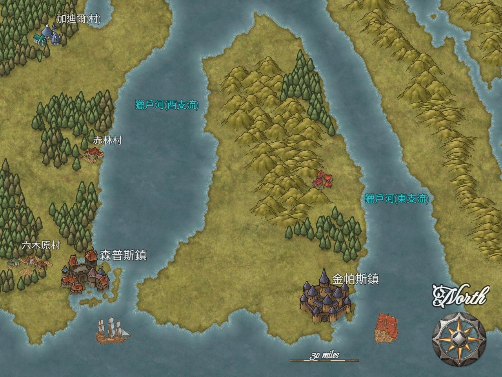
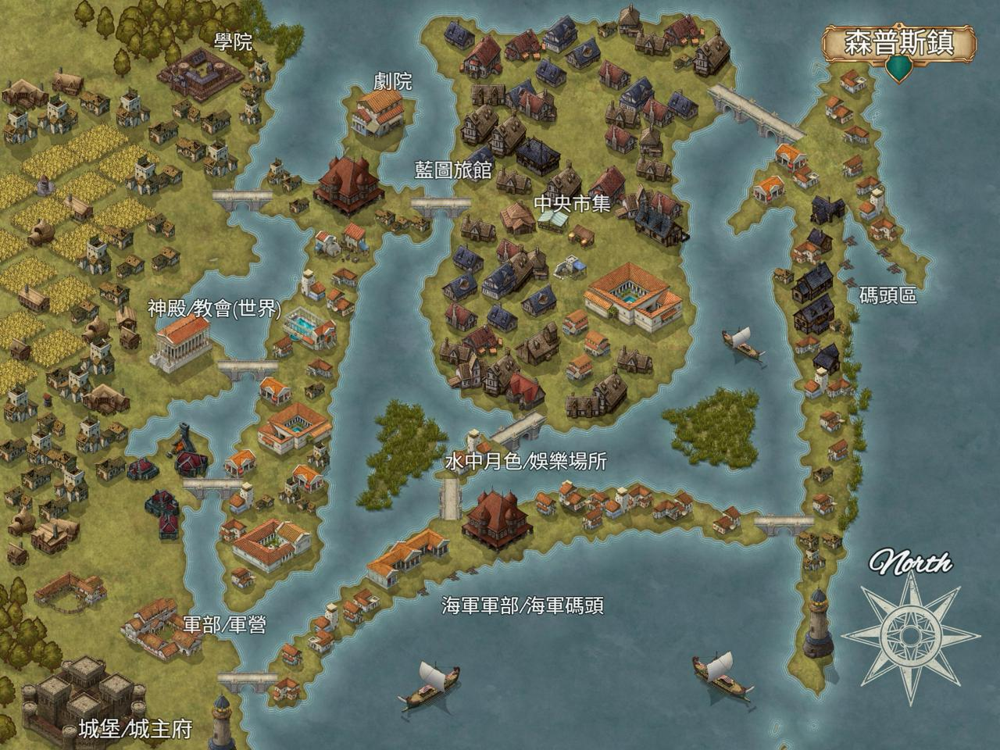

# 森普斯鎮

## 第一章 – 簡介

### 簡史

森普斯鎮位於大陸南端 獵戶河西面支流的海岸河口之處，城市由幾條橋樑加上河堤小島組成，是南方貿易一個重要的城鎮。經歷近百年的發展，由小村鎮到目前人口約8,000 的城鎮。  

百年前由冒險者森普斯創建，最初只為對抗來自河流上遊的 蛙頭怪人 (bullywug)，到發展商貿，建立海岸碼頭，直到最近期跟獵戶河西支流的 [金帕絲鎮](./ComplexTown.md) 建立聯盟；共同對抗來自外海的海族怪物保護兩鎮的船隊，是一座以術有專精的匠人城鎮。  

這一個位於河口三角區域西面的城鎮，擁有廣闊的海岸線以及來自西面的貿易伙伴，加上城鎮以專門這一種工作心態營運，對製造及本身的工作都以極為認真的態度，是城鎮的優勢。  

### 近況

略......  

### 位置

位於南部地區，獵戶河西面支流的海岸河口之處。  

### 結構

城鎮由橋樑連接不同的河岸小島與河岸地區，其中西岸地區是主要的市政及務農地區，雖然有城牆但其高度只能應付中小型生物的侵襲，但對於魔獸怪物還是沒太多的辦法。因此城鎮有不少專職士兵(約400人)。  

城牆約10呎高由木材建成，有箭塔及弩炮台，但防禦力一般；而且只包括了西邊部份到河流下遊位置。  

城內主要河中島有四個，分別是劍島，盾島，弓島及槍島。  

- **劍島**，位於河流下遊中部位置，北有盾島，南有弓島；西面有橋連接內陸；是高尚住宅地區。  
- **盾島**，位於城市的北部，面積廣闊，是河中島最繁榮的地方，大部份商業活動都在這裡發生。  
- **弓島**，位於下遊最南方位置，北有橋連接劍島；西面有橋連接內陸，是軍方碼頭區。  
- **槍島**，位於整個城鎮最東面的位置，也是最外圍的島；及民用碼頭區；主要是紅樹林及植被。  
- 內陸部份，是城市的西部，有多條橋連接往劍島，盾島，弓島及槍島。是農作地區及主要生活區。  

## 第二章 – 主要資料  

### 統計資料

**人口** : 約 8,000人 (神恩歷DG1443年記錄)  
**主要生產** : 糧食，武器加工，工藝及魚業。  
**物價** : 正常  
**陣營(Alignment)** : Lawful Good (人民) / Natural (政府)  

### 主要管治人物、軍事單位及組織

- **領主** : 巴特.森普斯 ～ 每一代的森普斯家族族長，由家族長老選出；會繼承 巴特.森普斯 這個名字。現任家主本名 帕斯，是一位能言善道的教師。  
- **政務官** : 維.普萊，是一位勤力的建築工人。  
- **軍務官** : 韋恩.波瀾，是一位水手出身的士兵。  

## 第三章 – 政府篇

森普斯鎮是一個由家族經營的城鎮，對外只有少量的軍隊，主要應付的不是其他城鎮或國家，而是上遊地區的 蛙怪及海岸出沒的鯊法魚人。因此政府架構簡單，行政也傾向簡便了事。  

## 第四章 – 宗教篇

### 創世神教會

小鎮的四島以外有一個島被名為 神之石，小島上只有一所創世神教會及小量的農地，由岩石所包圍保護，也是小鎮祭祀之地。實際上只是一間住了十來人的大屋，當中就是教會的牧師與被收養的孤兒。

## 第五章 – 民生篇

術有專攻，這個小鎮的每一家人多數都會繼承上一代留下的技術；當然偶然也有轉業的人，但大多數都是只專營一門技藝，也因此當地的工藝業非常有名。  

- **藍圖旅館/酒館** : 位於城鎮的內陸地區南部；是冒險者及旅行者比較常出沒的一所旅館。

～Ends～

[Back to Backgrounds](../Backgrounds.md)  
[Back to Front Page](../../../../index.md)  
