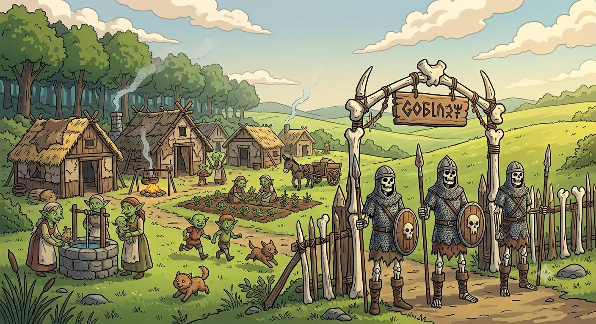
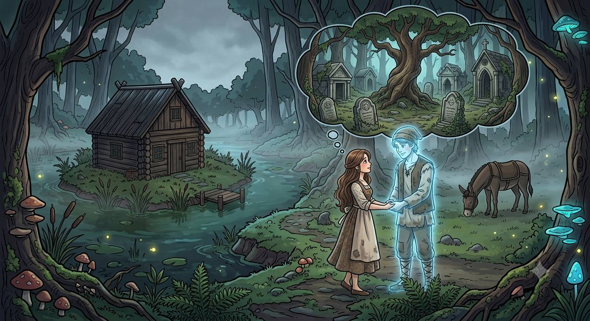

# Mission: R0038H  

Mission R0038H-零氏物語 ~ 一之三 忘亡忙妄  
DM：H  
Level：2-3  
人數：4-6  
日期：2026年8月9日 (星期日)  
時間：14:00 - 18:00  
Start Game Time & Place : 神恩曆1444年夏季，[森普斯鎮](../../backgrounds/location/SimpleTown.md)  
End Game Time & Place: 神恩曆1444年夏季，[森普斯鎮](../../backgrounds/location/SimpleTown.md)  

## 玩家

- Timmy: Wood Elf Scribe Wiz2 F, [Kaelia Liadon 凱莉雅．銀葉 (K)](../../characters/R0066_Kaelia.md)  
- 草皮: Aasimar Farmer Clr(Moradin,War)3 F, 瑞安  
- Mark: Human Merchant Ftr3(EK) M, 維吉爾 Vigil  
- JM: Elven Sage Drd2 F, 艾琳娜 Elena Starweave  
- HM: Human Acolyte Wlc3 F, Forsythia Jaune 科茜賽亞·尊  
- Peter: Human Sage Clr3(War) M, 康斯坦丁．李維斯  
- 44: Aasimar Hermit Clr2 M, 基爾．希默  
- Tim: Dwarf Farmer Clr1/Wiz2 M, 艾爾登  

## 任務  

森普斯鎮近日興起的午夜燒賣，背後似乎有重大的秘密。  
由於秘密被發現， 那一位“賣燒賣的老婆婆” 似乎已經遠離小鎮。  
然而因著另一地方曾出現吃人製作不死物的事件，一個委託出現~ 需要冒險者消滅 那一名將小朋友製成不死物的邪惡巫婆。  
在小鎮中冒險者經常聚集的小酒吧 ~ 藍圖旅館  
一則消息傳來，據說有一群聖騎士正尋找早前 “賣燒賣的老婆婆”......  

## 任務記錄

承上回[誘拐󠄆兒童](./R0037H.md)的死靈法師老婦（三嬸二姐，名Iliane）北遁，學者尼高再次代市政廳發任務，聘請冒險者消滅此患。  

由於上回三嬸(Ivy)已經指示二姐求助於大姐(Irene)，故眾人回鎮北沼澤向三嬸查問大姐情報：大姐沉迷魔法研究，唯在認識情人約翰後隱居北面3天外的樹林沼澤。另外亦指自己在年前認識聖騎士湯美後也改邪歸正，現今在鎮內營商牟利。  

一行人向北3天到達河口紅樹林的人口約50的赤林村，主要以木筏撈魚為生。據村民說，數天前見懷疑二姐經過村長走向村西北沼澤區，而該區就只住有一位年輕貌美女子。細問地點後，眾人隨即前往。  

通過一堆不死物後，二姐率眾多哥布林伏擊冒險隊伍，眾人正面突破撲殺二姐，並發現其真身為Green Hag。然後哥布林餘眾悉數投降，並指稱受二姐與其不死物脅迫行事。眾人隨哥布林回村清理脅迫的不死物後，告知沼澤區域陰森嚴寒，而且有鬼魂徘徊，哥布林不敢內進。  

眾人到達所述陰森嚴寒區域，K發現沼澤受大型魔法幻術包圍，阻止外物內闖。進內發現鬼魂約翰，以身前裝扮如故耕作，眾人嘗試接觸溝通不果。正當冒險者討論後著，大姐從容出現並支開約翰回沼澤小木屋。大姐向眾人解釋約翰為救自己被其左冒險者所殺，靈魂眷戀留下成鬼魂，兩人皆願繼續隱居在此。眾人亦查問[蟲型不死物](./R0023H.md)，大姐告知曾目睹於鎮西3-4天森林中古墓內，自己雖沉迷魔法但非死靈專家。  

了解大姐對附近無危害後，冒險隊打道回鎮結案，中途在三嬸處遇見尼高，滙報後尼高指會再安排任務，以調查鎮西古墓。  

## 人物表  

### 森普斯鎮人物  

[森普斯鎮](../../backgrounds/location/SimpleTown.md) 位於大陸南端，獵戶河西面支流的海岸河口之處。  

- **學者** : 尼高 (Nico) ～ 中年男性人類。隱士，專研歷史及不死物。面色蒼白黑色外袍，慵懶。有一魔寵能幹貓。在森普斯鎮藍圖旅館長期租用一房。  

---

～Ends～

[Back to Missions List](../Missions.md)  
[Back to Front Page](../../../../index.md)  
