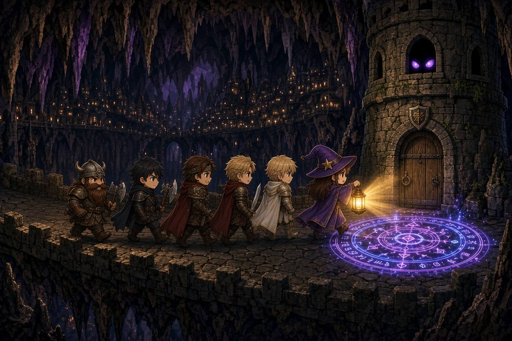

# Mission: R0042HM

Mission R0042HM - 惡魔之塔  
DM：HM  
Level：2-4  
人數：4-7  
日期：2026年9月13日 (星期日)  
時間：14:00 - 19:00  
Start Game Time & Place : 神恩歷DG1444年夏，希爾頓伯爵領  
End Game Time & Place: 神恩歷DG1444年夏，希爾頓伯爵領  

## 玩家

- Timmy: Dwarf Hermit Clr3(War) F, [Armas 阿密斯](../../characters/R0024_Armas.md)  
- 44: Tiefling(Abyssal) Entertainer Brd3 M, 奧多魯．卡利  
- Peter: Dwarf Soldier Ftr3(Champion) M, 艾恩．多羅  
- H: Human Sage Wiz3(Diviner) M, Dear Jace  
- Tim: Wood Elf Entertainer Pal3 F, 阿麗雅  
- Mark: Human Merchant Ftr3 M, 維吉爾 Vigil
- 子平: Human Farmer Ftr3 M, 白羽  
- JM: Human Guide Rog4 M, 凱爾  

## 任務記錄

春去夏來，上次「人為刀俎」之後，哈梅來先生再次召集冒險隊伍，希望能夠調查並清空「暗影迷城」到達的內城角樓。  

來到上次內城角樓，冒險隊伍發現馬道上的石地板，畫上一個魔法陣。當矮人艾恩．多羅踏入魔法陣 60尺範圍，魔法陣隨即觸發並召喚出數隻地獄犬。戰鬥途中，艾恩．多羅發現角樓上的六階窗戶上，有雙眼睛窺探冒險小隊。當冒險小隊上前清滅地獄犬，並開始以淋上聖水方式破壞召喚魔法陣時，六階窗戶的 夜嚎婆 (Night Hag) 騎著 夢魘獸 (Nightmare) 作為坐騎，從天而降突襲冒險者，同時也有低階惡魔在塔內旋轉樓梯下來夾擊。當完結 夢魘獸 並開始攻擊 夜嚎婆 時，對方使用 「Plane Shift」 法術逃脫。  

元氣大傷的冒險小隊，打算在角樓上短休，不料途中再次被 鷲魔 (Vrock) 襲擊。戰後用盡資源的冒險小隊決定回到城鎮滙報：事後打掃戰場發現，所有的惡魔怪物皆為召喚物，敗陣後會隨即消失，對方實體情況仍然未明。而且對方能重新建立召喚陣，因此宜盡快連續地清理地城，否則待對方重新建立防禦魔法便徒勞無功。  

## 地城地圖  

## 人物表  

### 希爾頓伯爵領人物  

希爾頓伯爵領位於大陸南部，帝國北端接近教國邊界。  

- **副市長** : 哈梅來 ～ 中年男性人類。中年，幹練政府文職打扮，主理希爾頓伯爵領一般事務。  

---

～Ends～

[Back to Missions List](../Missions.md)  
[Back to Front Page](../../../../index.md)  
