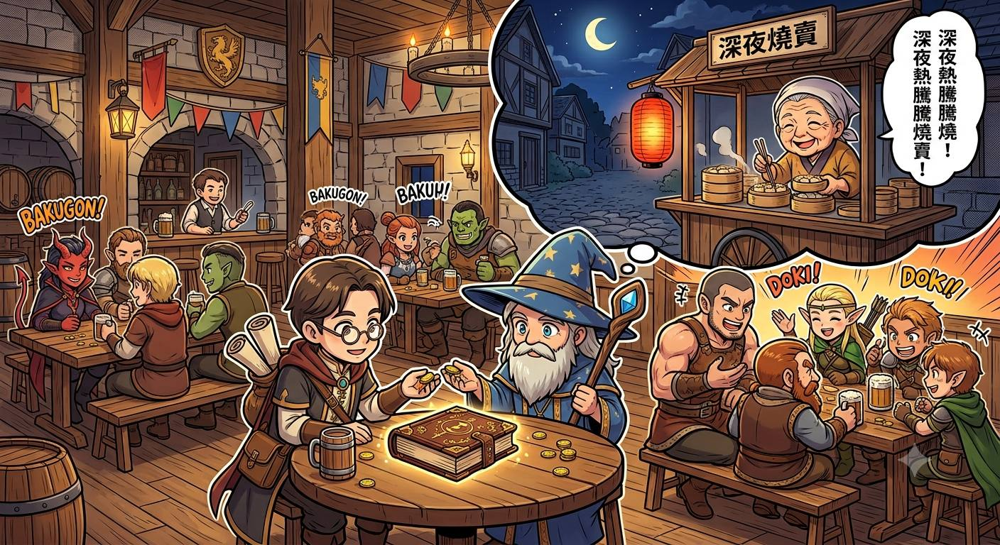

# Mission: R0037H  

Mission R0037H-零氏物語 ~ 一之二 午夜燒賣  
DM：H  
Level：2-3  
人數：4-6  
日期：2026年8月1日 (星期六)  
時間：14:00 - 18:00  
Start Game Time & Place : 神恩曆1444年夏季，[森普斯鎮](../backgrounds/location/SimpleTown.md)  
End Game Time & Place: 神恩曆1444年夏季，[森普斯鎮](../backgrounds/location/SimpleTown.md)  

## 玩家

- Timmy: Wood Elf Scribe Wiz1 F, [Kaelia Liadon 凱莉雅．銀葉 (K)](../characters/R0066%20Kaelia.md)  
- HM: Human Acolyte Wlc3 F, Forsythia Jaune 科茜賽亞·尊  
- Matt: Human Soldier Ftr2 M, Luven  
- Mark: Human Merchant Ftr3 M, 維吉爾 Vigil  
- 河馬: Orc Guide Clr3 M, 納奧  
- Tim: Dwarf Farmer Clr1/Wiz2 M, 艾爾登  

## 任務  

> 位於帝國內的南端地區，獵戶河流域一帶；金帕斯鎮往西穿過河道是一個名為森普斯鎮的地方。在這個術有專攻的小鎮，近日出現一則傳聞～  
> 在午夜的時間，有廚師在鎮外販賣夜宵......  
> 這並不尋常的行動讓不少人好奇也擔心是不是野外魔物假扮.  
> 然而自從這消息傳開.......  
> 鎮外也傳出附近一帶的村落出現小朋友失蹤的事件.  
> 最近的一條小村位於森普斯鎮西北面半日路 ~ 六木原村  
> 在小鎮中冒險者經常聚集的小酒吧 ~ 藍圖旅館  
> 兩名村民求助於冒險者，於是一行冒險者就開始調查這件事了......  

## 任務記錄

> 眾多冒險者在安全舒適的藍圖旅館投宿，晚飯時間有冒險者提及鎮東區域，近日晚間有人稱「三嬸」的老婦小販售賣「燒賣」這肉類小食，美味唯價格高昂，眾人起哄是夜前往。同時，一位名為尼高的學者進店，與大廳內另一法師交收書藉，並從法師得知傳聞，城西半日腳程的六木原村有小童失蹤，尼高表示會顧人一同前往調查，此事是否與兩人正跟進的不死物有關。交易完成後，法師離開而尼高就地投宿。  
>
> 
>
> 飯後夜深，眾冒險者於鎮東北靠近學院，光顧了在大燈籠照明下營業的手推車小販檔，期間客人絡繹不絕，尤以來自學院的寄宿學童為主，小販老婦三嬸亦相當疼愛這些小顧客。Luven檢查了食物食材無異樣，K亦認為只是尋常人類老婦，不過維吉爾則看出老婦有化妝易容並非真身，只是無法辨清真實面目。言談間老婦指燒賣這奇特菜式則由她們三姐妹研發，她本人獨居鎮北森林，而兩位姐姐則居於遠方。眾人飽餐後回旅館，維吉爾則把燒賣帶回旅館找魔法鑑証，無異常。  
>
> 次日早上，學者尼高登告示求聘，正正是昨夜尼高法師相討之事。尼高指出正在處理和科茜賽亞、納奧一起遇過的 [由蟲組成的不死物一事](./Mission%20R0023H.md) ，不知六木原村事件會否有關，聘冒險隊伍陪同調查，下午出發。  
>
> 一行人晚間到達村落，與精靈村長父子和失蹤兒童父母面談，得知村北森林近日有老婦以糖果向村童示好，村長兒子雖曾警告其他村童，但仍有三家村童接連失蹤。經小童足印追蹤至村北森林，於地底樹洞中有一老婦以兒童製作大量骷髏，眾人雖清理全部骷髏，但仍被老婦以落石斷後成功逃脫。眾人發現三具較近期的小童死體，以及些小童衣物。眾人安頓好其他不死物後，把三具近期遺體和衣物帶回村落辨識，判斷為其中兩位失蹤者。另外，科茜賽亞也判斷出遺體曾被類似當成食材般起肉拆骨，之後才以魔法製作成不死物骷髏，得知此判斷的K對材料不明來歷的燒賣有些聯想，唯不欲多言。  
>
> 眾人過夜休息，次日午後回到落石處向外追蹤，沿足印向東半天路程，於入黑後抵達鎮北森林，在沼澤地聽見女聲爭吵。原來是燒賣小販老婦三嬸和其二姐（地底樹洞老婦），三嬸表示已經改邪歸正，不願幫助二姐逃離冒險者追捕，著其離開找大姐庇護。爭吵間二人發現冒險者靠近，二姐馬上逃入沼澤，三嬸則表明與己無關，就走到沼澤旁的糖果屋，如常推著小販車進鎮開店。眾人向北追二姐，無果回鎮。  
>
> 
>
> 事後，尼高代表冒險隊伍向鎮領主方滙報，得到獎賞並分發眾人後，再回到森林會面三嬸，查問三姐妹經歷。三嬸和盤托出，指大姐為女巫，懂以蟲組成不死物，住在森林北2、3天腳程的沼澤地；而二姐則只是低階死靈法師。尼高判斷大姐女巫與其追查的事件有關，打算與對方接觸。  

～Ends～

[Back to Missions List](./Missions.md)  
[Back to Front Page](../../../README.md)  
