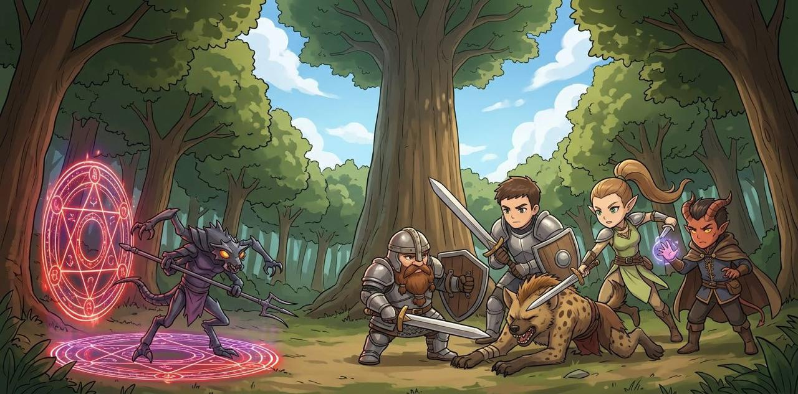
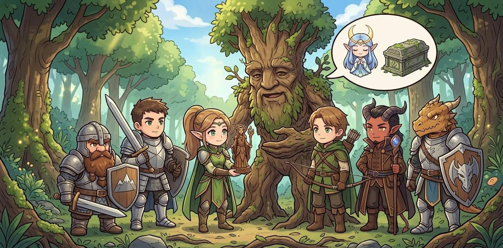

# Mission: R0043TY  

Mission R0043TY-古戰場的痕跡  
DM：Tim Yu  
Level：2-4  
人數：4-7  
日期：2026年10月4日 (星期日)  
時間：14:00 - 18:00  
Start Game Time & Place : 神恩歷DG1444年夏  
End Game Time & Place: 神恩歷DG1444年夏  

## 玩家

- Timmy: Wood Elf Scribe Wiz3 (Bladesigner) F, [Kaelia Liadon 凱莉雅．銀葉 (K)](../../characters/Character_Kaelia.md)  
- 44: Tiefling(Infernal) Charlatan Wlc2 M, 伊格尼斯.辛德  
- 子平: Human Farmer Ftr3 M, 白羽  
- 喬: Human Guide Rgr3 M, 沙普林 Sapling  
- 堯: Orc Scribe Wiz3(Abjurer) M, 亞祖凱特．詹圖文  
- Peter: Dwarf Soldier Ftr4(Champion) M, 艾恩．多羅  
- HM: Brass Dragonborn Noble Ftr2 M, 法夫尼爾·奧林  

## 任務  

大病初癒的安德森想請人幫忙護衛...  

## 任務記錄

藥材舖半精靈老闆A，再次為森普斯鎮西北面森林內的德魯伊族，尋找具經驗的冒險者協助。眾人準備充足後，在遊俠沙普林帶路下到達德魯伊村落，受德魯伊長老和老闆A友人安德森接見並介紹近況。魔人辛德與獸人詹圖文，對跟隨安德森而來的幼女相當有興趣，為避免干擾會面，女精靈K 自薦帶小女孩遊玩嬉戲。事後K 判斷小女孩為構築生物(Constructs)，高約4尺重量約百多磅，密度接近全為金屬體的機關生物結構；外披仿真人類皮膚，活動時能夠聽到內部關節的機械構造活動聲響，運動時仔細留意就能發現關節活動有欠流暢自然；行為性格模仿於人類5、6歲的小女孩，只會簡單普通語單字，視安德森先生為父親。  

回說會議內容，經過多起事件後，長老判斷在德魯伊村落附近，會不定期不定點地開啟下界的傳送門，當中有機會有下界生物通過而現身。長老認為安德森曾到達的遺跡，有可能有該些傳送門出現的線索，因此要求冒險隊伍：  

一、護送安德森到達遺跡再次調查；  
二、查探傳送門出現的原因和規律，及關閉方法；  
三、查探下界生物越過傳送門的意圖目標；  
四、清理出現的下界生物和傳送門。  

眾人帶領安德森進入森林，前往遺跡方向，在清掃一群召喚自下界的Gnoll後，在一棵大樹面前，遇到帶領土狼的豺狼人頭領 (Gnoll Pack Lord) 。對方發現安德森後，就衝著安德森本人施襲。眾人擊倒頭領一刻，遠方約一百尺外出現一個下界傳送魔法陣，並且傳送出一隻毒蟲羅斯魔(Mezzoloth)，現身後以黑暗術掩護下，嘗試擊暈並帶走安德森先生。眾人力阻並擊殺對方後，發現毒蟲人和頭領的身軀都留在現界，並不像其他召喚的下界生物般消失。

下界傳送陣在戰鬥結束之時，隨毒蟲人的生命而隨即關上。眾人拿緊時機研讀傳送陣，發現傳送陣是在有人召喚強力下界生物成功、或該生界回去下界之時，低櫞率在視界範圍內隨機出現。這種傳送陣是通往下界的焦炎火獄(Gehenna)，其中一種關閉方法是擊倒在附近出現下界生物。在傳送陣完全消失後，眾人打掃戰場時，遊俠沙普林認出此地正正是前次任務「童話的主人(R0032TY)」當中，遇到紅藍眼機械人的戰場。

在原地短休，並等待安德森甦醒期間，森林中的巨大樹木突然發出動靜，站起來變成一位巨大的樹人。目及巨大樹人開始移動，眾人上前慰問交涉。得知對方自稱為「樹人先生」，在1400年前的神恩曆44年，受到稱為「月小姐」的女性精靈所托，陷入休眠狀態並守護著樹根底的石棺。但樹人隨即發現石棺失蹤，眾人只在樹根底找到一個昂貴的精靈雕像，由K 鑑定出這是精靈神(Corellon Larethian)的神像，再加上樹人失去了1400年的經歷和成長，眾人懷疑這是九環高階法術 Imprisonment 做成，而K 亦同時懷疑「月小姐」與月亮女神(Sehanine Moonbow)有關。可惜K 畫出 Sehanine 肖像時，樹人認為與「月小姐」本人並不相似。

至於石棺方面，樹人指出「月小姐」交托只在世界和平之時、或者萬不得已的情況下，此外應避免打開。眾人想起在「[唯一](./R0035TY.md)」時，導致安德森昏迷的石棺，便在施法加速安德森轉醒後，告知其樹人、月小姐和石棺交托之事。安德森告之樹人已經把石棺帶到安全之處，亦坦承曾經打開石棺；樹人便指出只有「月小姐」的血脈才能打開石棺，並提出想了解石棺現狀。而安德森亦理解到自己已經成為下界生物的綁架對像，而且由樹人方面也許比遺跡找到更多關於石棺和下界生物的資訊，故決定帶樹人打道回去德魯伊村莊。眾人也把沒有消失的毒蟲人和豺狼人頭領身軀帶回德魯伊村莊調查，而精靈神聖像亦由K 恭敬地請走。

## 人物表  

### 森普斯鎮人物  

[森普斯鎮](../../backgrounds/location/SimpleTown.md) 位於大陸南端，獵戶河西面支流的海岸河口之處。  

- **藥材舖老闆** : 老闆A ～ 男性半精靈。銀髮藍眼。藥材舖老闆，經常發出冒險者任務。  

### 德魯伊村落人物

- **德魯伊長老** : 長老 (500+) ～ 年老男性高等精靈。德魯伊部落長老。德魯伊部落的標記於森普斯鎮西北3天路程森林之中，由標記位置深入1天森林才到達德魯伊部落。  
- **考古學家** : 安德森 ～ 中年男性人類。考古學家，因緣得到一危險石棺並成功打開。  
- **女孩狀機械人** : ? ～ 幼女人類外貌的構築生物(Constructs)。自石棺中走出，視安德森先生為父親。  
- **樹人** : 樹人 (400＋) ～ 巨大樹人。自千四年前受託休眠至今。  

---

～Ends～

[Back to Missions List](../Missions.md)  
[Back to Front Page](../../../../index.md)  
